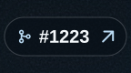
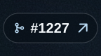
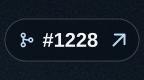
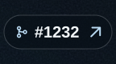

<!-- Generated by scripts/build.mjs. Edit profile.config.json or the renderer. -->

<picture><source media="(max-width: 680px)" srcset="./dist/profile-mobile.f84a089865.svg"></picture><picture><source media="(max-width: 680px)" srcset="./dist/panel/n8n-io-nod-r0-mobile.a71b253395.svg"></picture><a href="https://github.com/n8n-io/nod/pull/1223"><picture><source media="(max-width: 680px)" srcset="./dist/panel/n8n-io-nod-r0-pr0-mobile.1dc513de52.svg"></picture></a><a href="https://github.com/n8n-io/nod/pull/1227"><picture><source media="(max-width: 680px)" srcset="./dist/panel/n8n-io-nod-r0-pr1-mobile.b7c605a74f.svg"></picture></a><a href="https://github.com/n8n-io/nod/pull/1228"><picture><source media="(max-width: 680px)" srcset="./dist/panel/n8n-io-nod-r0-pr2-mobile.159b137387.svg"></picture></a><a href="https://github.com/n8n-io/nod/pull/1232"><picture><source media="(max-width: 680px)" srcset="./dist/panel/n8n-io-nod-r0-pr3-mobile.cc211af868.svg"></picture></a><a href="https://github.com/n8n-io/nod/pull/1233"><picture><source media="(max-width: 680px)" srcset="./dist/panel/n8n-io-nod-r0-pr4-mobile.9a42d67052.svg"></picture></a><picture><source media="(max-width: 680px)" srcset="./dist/panel/stablyai-orca-r0-mobile.d7a3520bbb.svg"></picture><a href="https://github.com/stablyai/orca/pull/44637"><picture><source media="(max-width: 680px)" srcset="./dist/panel/stablyai-orca-r0-pr0-mobile.770bba70e4.svg"></picture></a><a href="https://github.com/stablyai/orca/pull/44762"><picture><source media="(max-width: 680px)" srcset="./dist/panel/stablyai-orca-r0-pr1-mobile.9538341796.svg"></picture></a><picture><source media="(max-width: 680px)" srcset="./dist/panel/the-pr-agent-pr-agent-r0-mobile.702dfeb937.svg"></picture><a href="https://github.com/The-PR-Agent/pr-agent/pull/5022"><picture><source media="(max-width: 680px)" srcset="./dist/panel/the-pr-agent-pr-agent-r0-pr0-mobile.8ab8502608.svg"></picture></a><a href="https://github.com/The-PR-Agent/pr-agent/pull/5023"><picture><source media="(max-width: 680px)" srcset="./dist/panel/the-pr-agent-pr-agent-r0-pr1-mobile.da900df6cb.svg"></picture></a><picture><source media="(max-width: 680px)" srcset="./dist/panel/ministackorg-ministack-r0-mobile.33ddc31d64.svg"></picture><a href="https://github.com/ministackorg/ministack/pull/2745"><picture><source media="(max-width: 680px)" srcset="./dist/panel/ministackorg-ministack-r0-pr0-mobile.495b85a038.svg"></picture></a><a href="https://github.com/ministackorg/ministack/pull/2746"><picture><source media="(max-width: 680px)" srcset="./dist/panel/ministackorg-ministack-r0-pr1-mobile.96dbc4740c.svg"></picture></a><picture><source media="(max-width: 680px)" srcset="./dist/panel/awslabs-mcp-r0-mobile.4f42a9423f.svg"></picture><a href="https://github.com/awslabs/mcp/pull/5123"><picture><source media="(max-width: 680px)" srcset="./dist/panel/awslabs-mcp-r0-pr0-mobile.79c4a19929.svg"></picture></a><picture><source media="(max-width: 680px)" srcset="./dist/panel/repowise-dev-repowise-r0-mobile.ee421e5ec2.svg"></picture><a href="https://github.com/repowise-dev/repowise/pull/5887"><picture><source media="(max-width: 680px)" srcset="./dist/panel/repowise-dev-repowise-r0-pr0-mobile.1fa13bd170.svg"></picture></a><picture><source media="(max-width: 680px)" srcset="./dist/panel/tabularisdb-tabularis-r0-mobile.3ceb3f99a9.svg"></picture><a href="https://github.com/TabularisDB/tabularis/pull/1602"><picture><source media="(max-width: 680px)" srcset="./dist/panel/tabularisdb-tabularis-r0-pr0-mobile.46f6bc923c.svg"></picture></a><picture><source media="(max-width: 680px)" srcset="./dist/panel/harnessrouter-harnessrouter-r0-mobile.bee8593114.svg"></picture><a href="https://github.com/HarnessRouter/harnessrouter/pull/718"><picture><source media="(max-width: 680px)" srcset="./dist/panel/harnessrouter-harnessrouter-r0-pr0-mobile.8245ca3a94.svg"></picture></a><a href="https://github.com/search?q=author%3Aemreocell%20is%3Apr%20is%3Amerged%20-user%3Aemreocell&amp;type=pullrequests"><picture><source media="(max-width: 680px)" srcset="./dist/panel/browse-all-mobile.ca552d34e7.svg"></picture></a><picture><source media="(max-width: 680px)" srcset="./dist/panel/call-to-action-mobile.1601d2ff02.svg"></picture><a href="mailto:emreocell1219@gmail.com"><picture><source media="(max-width: 680px)" srcset="./dist/panel/contact-talk-mobile.77ccd344a9.svg"></picture></a><a href="https://www.linkedin.com/in/emreocell/"><picture><source media="(max-width: 680px)" srcset="./dist/panel/contact-linkedin-mobile.f32b918cfd.svg"></picture></a><a href="https://webioo.com.tr/"><picture><source media="(max-width: 680px)" srcset="./dist/panel/contact-website-mobile.040b93aa1c.svg"></picture></a>

Profile in plain text

**Emre Öcel** · Computer Engineer · Samsun, Türkiye 
Full Stack Developer at [Webioo](https://webioo.com.tr/).

I build web products, AI agents and the systems behind them.

**A focused toolkit:** PHP · MySQL · JavaScript · Python · Rust.

**Selected open-source contributions:**

- [n8n Nod](https://github.com/n8n-io/nod) - [#1223](https://github.com/n8n-io/nod/pull/1223), [#1227](https://github.com/n8n-io/nod/pull/1227), [#1228](https://github.com/n8n-io/nod/pull/1228), [#1232](https://github.com/n8n-io/nod/pull/1232), [#1233](https://github.com/n8n-io/nod/pull/1233)
- [Orca](https://github.com/stablyai/orca) - [#44637](https://github.com/stablyai/orca/pull/44637), [#44762](https://github.com/stablyai/orca/pull/44762)
- [PR-Agent](https://github.com/The-PR-Agent/pr-agent) - [#5022](https://github.com/The-PR-Agent/pr-agent/pull/5022), [#5023](https://github.com/The-PR-Agent/pr-agent/pull/5023)
- [Ministack](https://github.com/ministackorg/ministack) - [#2745](https://github.com/ministackorg/ministack/pull/2745), [#2746](https://github.com/ministackorg/ministack/pull/2746)
- [AWS MCP Servers](https://github.com/awslabs/mcp) - [#5123](https://github.com/awslabs/mcp/pull/5123)
- [RepoWise](https://github.com/repowise-dev/repowise) - [#5887](https://github.com/repowise-dev/repowise/pull/5887)
- [Tabularis](https://github.com/TabularisDB/tabularis) - [#1602](https://github.com/TabularisDB/tabularis/pull/1602)
- [HarnessRouter](https://github.com/HarnessRouter/harnessrouter) - [#718](https://github.com/HarnessRouter/harnessrouter/pull/718)

**Contact:** [Let’s talk](mailto:emreocell1219@gmail.com) · [LinkedIn](https://www.linkedin.com/in/emreocell/) · [Webioo](https://webioo.com.tr/)

**GitHub activity:** 4,222 contributions from 2025-11-21 through 2026-11-20. 
Last successful refresh: 20 NOV 2026 · 15:44 UTC. Activity refreshes daily. 
[View activity on GitHub](https://github.com/emreocell?tab=overview)

